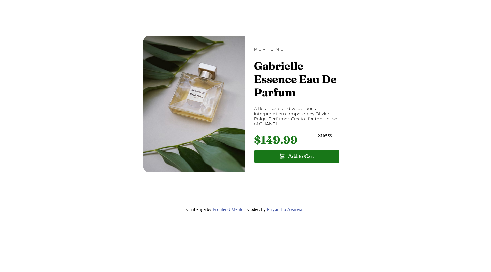
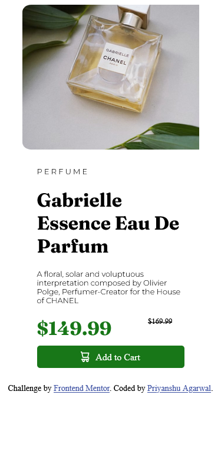

# Frontend Mentor - Product preview card component solution

This is a solution to the [Product preview card component challenge on Frontend Mentor](https://www.frontendmentor.io/challenges/product-preview-card-component-GO7UmttRfa). Frontend Mentor challenges help you improve your coding skills by building realistic projects. 

## Table of contents

- [Overview](#overview)
  - [The challenge](#the-challenge)
  - [Screenshot](#screenshot)
  - [Links](#links)
- [My process](#my-process)
  - [Built with](#built-with)
  - [What I learned](#what-i-learned)
  - [Continued development](#continued-development)
- [Author](#author)

## overview
### The challenge

Users should be able to:

- View the optimal layout depending on their device's screen size
- See hover and focus states for interactive elements

### Screenshot

### Links
- Live Site URL:[Frontend Mentor | Product preview card component](https://productpreviewcardcomponent4206.netlify.app/)

### Built with

- Semantic HTML5 markup
- CSS custom properties
- Flexbox

### What I learned

Working with this project made me realize what's the true meaning of learning by working.
While working on this project I learned concepts like :-

-dividing and conquer technique
-Flexbox properties 
-Resposive Design of Website
-Use of google fonts 

### Continued development

During this project I learned a lot about responsive designs and hope to refine that in my upcoming projects.
While working with images properties and adjusting the width and height properties of it for being resposive is one part of skill I really need to work upon.
Not only this I also have to learn other concepts like javascript to complete my Frontend part atleast first.
## Author

- Website - [Frontend Mentor | Product preview card component](https://productpreviewcardcomponent4206.netlify.app/)
- Frontend Mentor - [@Priyanshu4206](https://www.frontendmentor.io/profile/Priyanshu4206)
